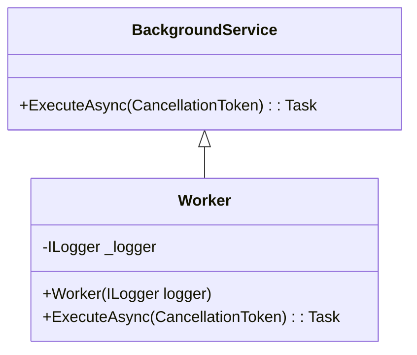

# BackgroundService Worker Example

This project demonstrates a .NET Worker Service using the `BackgroundService` class. The Worker runs background tasks in a loop, logging the current time every second.

## What is BackgroundService?

`BackgroundService` is an abstract base class in .NET for implementing long-running background tasks. It provides a simple way to run code in the background, typically used for services like scheduled jobs, message processing, or monitoring.

## Worker Class Overview

- Inherits from `BackgroundService`.
- Uses dependency injection to receive an `ILogger<Worker>`.
- Runs a loop in `ExecuteAsync`, logging the time every second until cancellation is requested.

## UML Visualization

## How to Run

1. Build the project with .NET 9.
2. Run the service. It will log the current time every second.

## References
- [Microsoft Docs: BackgroundService](https://learn.microsoft.com/en-us/dotnet/api/microsoft.extensions.hosting.backgroundservice)
