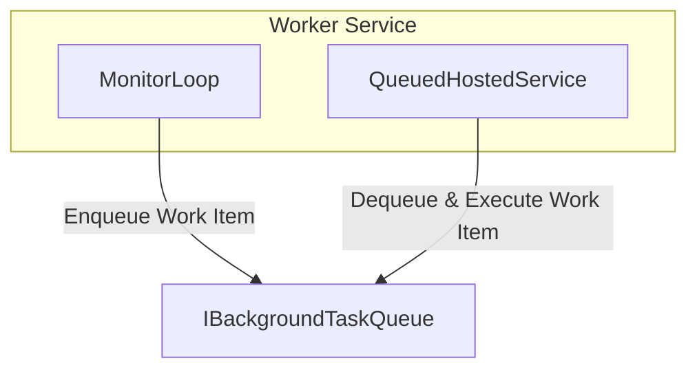

# Queued Background Task Worker Service

This project demonstrates a .NET Worker Service for managing and executing background tasks using a queue-based approach. It is built with .NET 9 and C# 13.0.

## Components

### 1. IBackgroundTaskQueue
`IBackgroundTaskQueue` is an interface that defines a contract for queuing and dequeuing background work items:
- `QueueBackgroundWorkItemAsync(Func<CancellationToken, ValueTask> workItem)`: Enqueues a background task.
- `DequeueAsync(CancellationToken cancellationToken)`: Dequeues the next background task for execution.

### 2. MonitorLoop
`MonitorLoop` is a class that monitors console input and enqueues background tasks when the user presses the `W` key. It uses the `IBackgroundTaskQueue` to add work items and logs the progress of each task.

### 3. QueuedHostedService
`QueuedHostedService` is a `BackgroundService` that continuously dequeues and executes background tasks from the queue. It logs the status and handles exceptions during task execution.

## Architecture Diagram

- **MonitorLoop**: Listens for user input and enqueues tasks.
- **QueuedHostedService**: Runs in the background, dequeues, and executes tasks.
- **IBackgroundTaskQueue**: Manages the queue of background tasks.

## Usage Example
1. Run the service.
2. Press `W` in the console to enqueue a background task.
3. The task will be processed by `QueuedHostedService` and progress will be logged.

---
For more details, see the source files:
- `IBackgroundTaskQueue.cs`
- `MonitorLoop.cs`
- `QueuedHostedService.cs`
